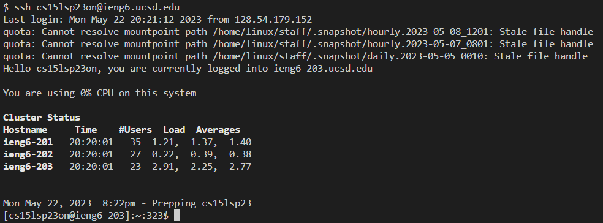
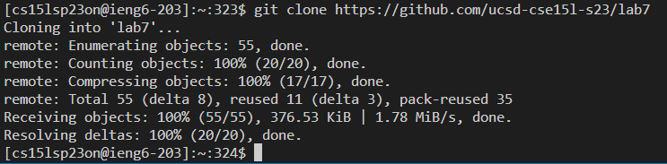
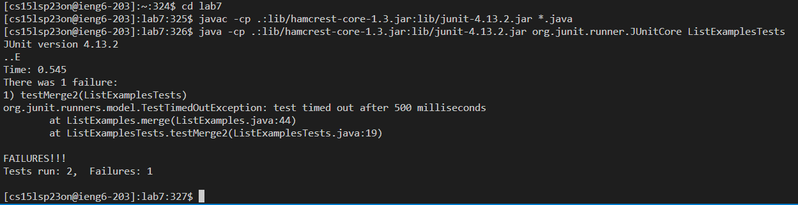
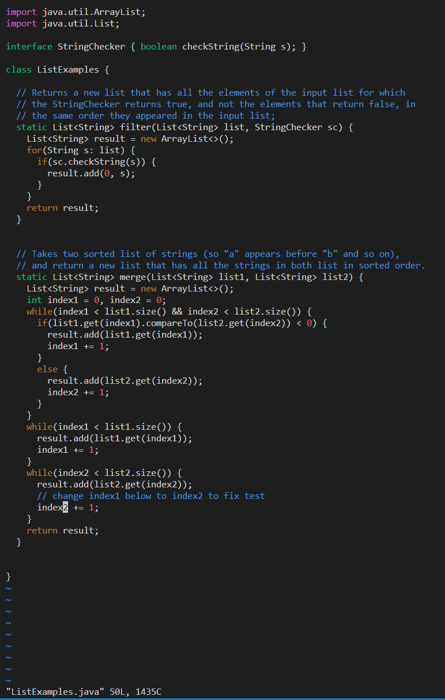
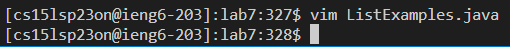
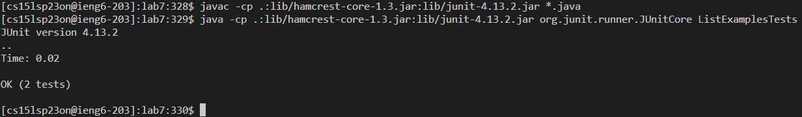
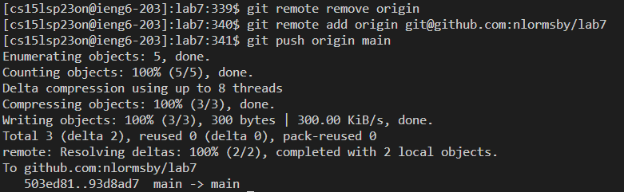

## Step 4

Keys pressed: `<up>` The last command I ran on my local computer was `ssh cs15lsp23on@ieng6.ucsd.edu`
`
## Step 5

Keys pressed: `<ctrl>+<v>` The command `git clone https://github.com/ucsd-cse15l-s23/lab7` was in my clipboard.

## Step 6

Keys pressed: `<up><up><up><up><up><enter><up><up><up><up><up><enter>` The `javac -cp .:lib/hamcrest-core-1.3.jar:lib/junit-4.13.2.jar *.java` command was in my search history. As well as the command `java -cp .:lib/hamcrest-core-1.3.jar:lib/junit-4.13.2.jar org.junit.runner.JUnitCore ListExamplesTests` which was accessed the same way.
  
## Step 7

Keys pressed: `<up><up><up><up><up><enter><43j><11l><x><i><2><esc><:wq><Enter>` The command `vim ListExamples.java` was in my search history.
  
## Step 8

Keys pressed: `<up><up><up><enter><up><up><up><enter>` The `javac -cp .:lib/hamcrest-core-1.3.jar:lib/junit-4.13.2.jar *.java` command was in my search history. As well as the command `java -cp .:lib/hamcrest-core-1.3.jar:lib/junit-4.13.2.jar org.junit.runner.JUnitCore ListExamplesTests` which was accessed the same way.
  
## Step 9

Keys Pressed: `git add ListExamples.java<enter>git commit -m '1 to 2' <enter> git remote remove origin <enter> git remote add origin git@github.com:nlormsby/lab7 <enter> git push origin main <enter>`
